<div align="center">

# Luma Retrofit: Open-Source Urine Test Strip Reader

**Open-source CAD for a removable urine test strip reader (a urinalysis device) that retrofits into existing public toilets. It needs no drilling, new wiring or plumbing.**

**[Website and live 3D model](https://tamnisan.github.io/luma/)** · **[Download ZIP](https://github.com/tamnisan/luma/archive/refs/heads/main.zip)**

[](LICENSE)
[](#3-solidworks-native-parametric)
[](#open-the-model)
[](#1-browser-3d-viewer-no-install)
[](#project-status)

[Quick start](#quick-start) •
[Open the model](#open-the-model) •
[Design](#design-overview) •
[Build from source](#building-from-source) •
[Status](#project-status) •
[Contributing](#contributing)

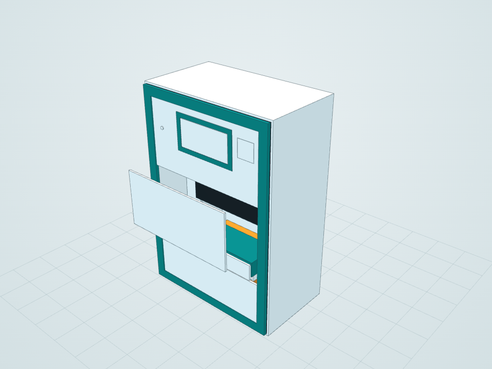

</div>

> [!WARNING]
> **This is an engineering prototype (Rev A), not a medical device.** It is not a fabrication release and has not been clinically validated. The sample transport, clamp mechanisms, mount load capacity, sealing and measurement accuracy have not been tested. If you build or deploy anything based on this design, you are responsible for safety, structural and regulatory approval. Read [ENGINEERING.md](ENGINEERING.md) first.

## About

Luma is a compact reflectance reader for urine test strips, designed to be added to public toilets that already exist. One common enclosure takes interchangeable, reversible mounts, so an installer can choose whichever fits the site: a partition edge, a grab-rail post, the top of a cubicle wall, a free-standing pedestal, a smooth tiled surface or structural steel. It runs from a DC supply or a removable battery.

The intended workflow keeps clean and used material apart:

1. The user places a wetted strip in a keyed disposable carrier.
2. The reader checks that the cover is closed and a strip is present.
3. An RGB sensor with two white LEDs scans the pads.
4. The result is shown privately on the display.
5. The used strip goes into a closed waste cartridge.

Unused strips stay in a separate sealed cassette, away from the measurement path.

It is an open-hardware starting point for anyone working on **point-of-care diagnostics**, **smart toilets** or **public health kiosks**. The design reserves space for an **Arduino Uno** controller and a **TCS34725 RGB colour sensor**, and the enclosure is designed for **3D printing** in PC-ABS.

The whole model is **generated by code**: a C# program drives the SolidWorks API, builds every part and assembly from a single dimension table, then checks the result. It is also exported to open formats, so anyone can view, modify, 3D-print or re-use the design **without owning SolidWorks**.

## Highlights

- **109 native SolidWorks parts**, one assembly and a general-arrangement drawing
- **6 reversible mounts × 2 power options = 12 configurations**, plus installed, service and exploded views
- **Works without CAD software:** an offline 3D viewer (double-click `START.html`), STEP files for any CAD program and STL files for 3D printing
- **Parametric and reproducible:** the layout comes from one table in [`src/LumaBuilder.cs`](src/LumaBuilder.cs), and each rebuild is written to a new timestamped folder
- **Checked on every build:** no static interferences in any of the 12 mount/power configurations, all 125 sketches fully constrained, and every part within 0.15 mm of its BOM envelope
- **Documented:** load and stability assumptions, installation site survey, service sequence, mounting-compatibility matrix and cost allowances in [ENGINEERING.md](ENGINEERING.md)

## Gallery

<table>
  <tr>
    <td align="center">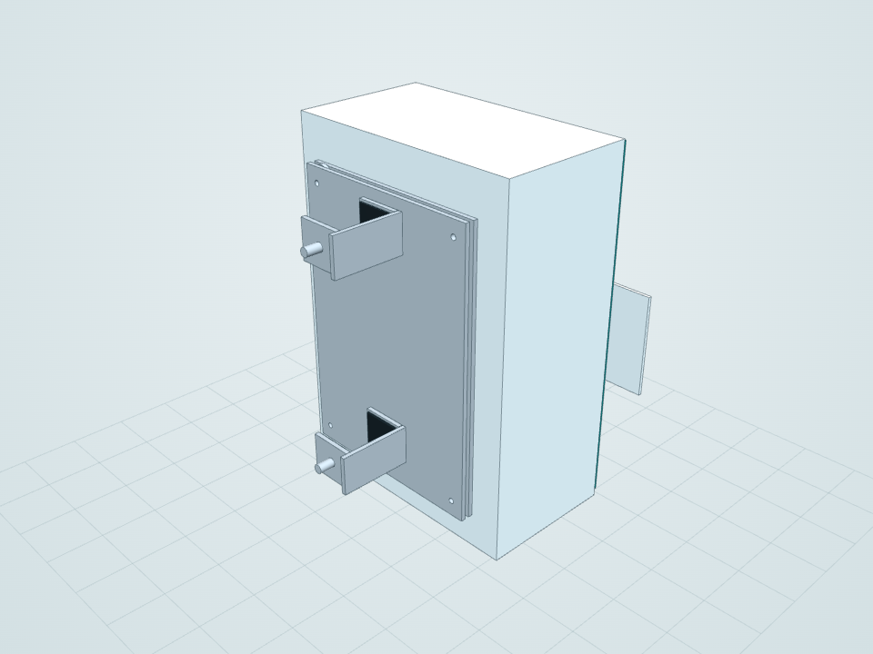<br><b>Partition clamp</b><br><sub>Padded jaws for 12–50 mm panels</sub></td>
    <td align="center">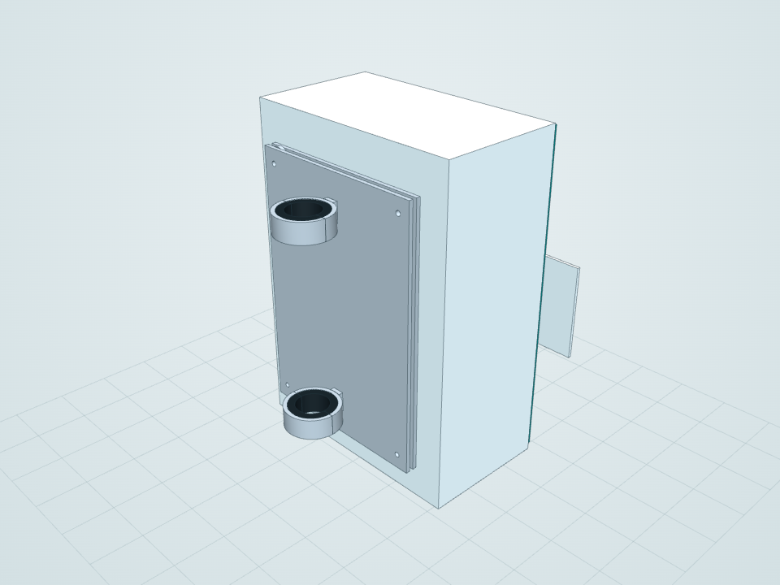<br><b>Rail clamp</b><br><sub>Split clamp on a 32 mm post</sub></td>
    <td align="center">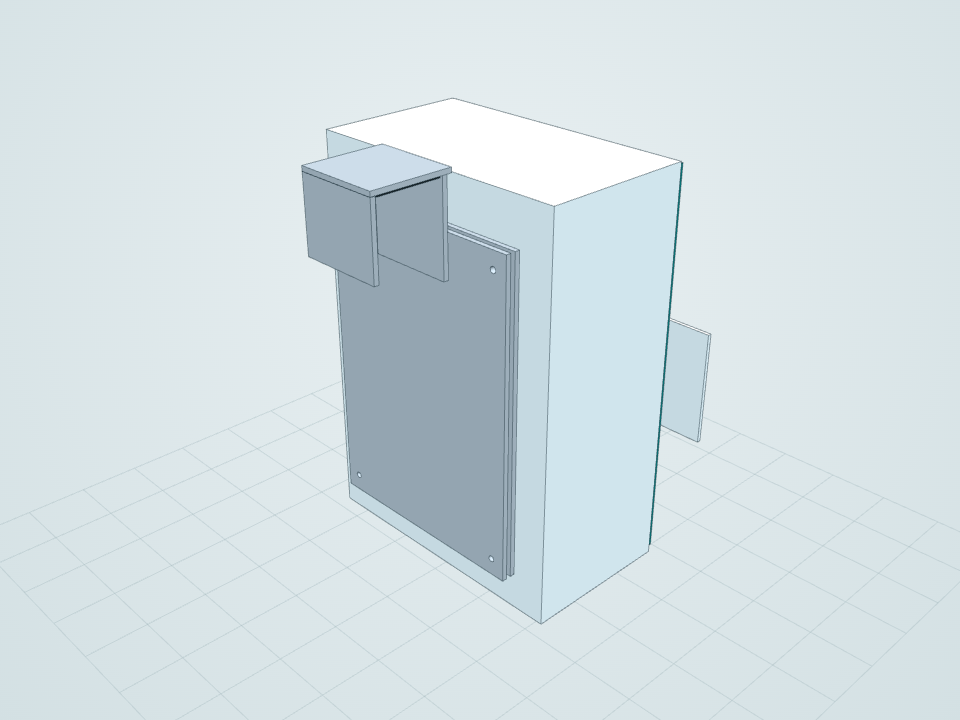<br><b>Over-partition hook</b><br><sub>55 mm padded gap</sub></td>
  </tr>
  <tr>
    <td align="center">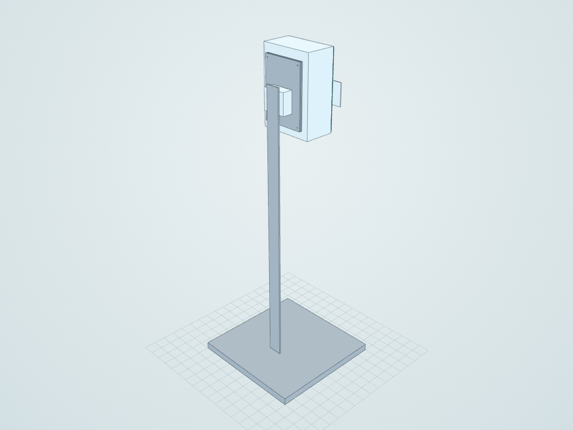<br><b>Floor pedestal</b><br><sub>Ballasted base, no anchors</sub></td>
    <td align="center">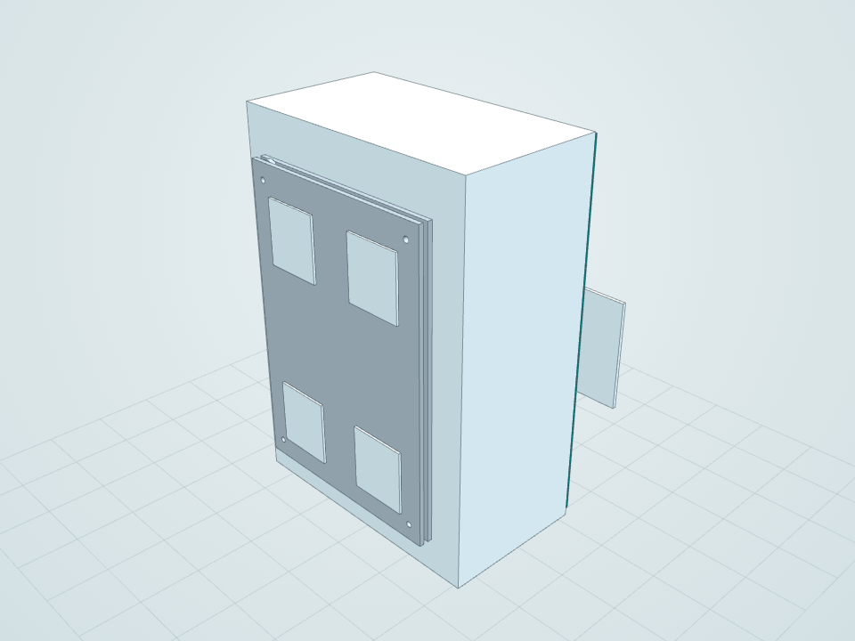<br><b>Smooth-surface pads</b><br><sub>Removable pads + tether (reserved)</sub></td>
    <td align="center">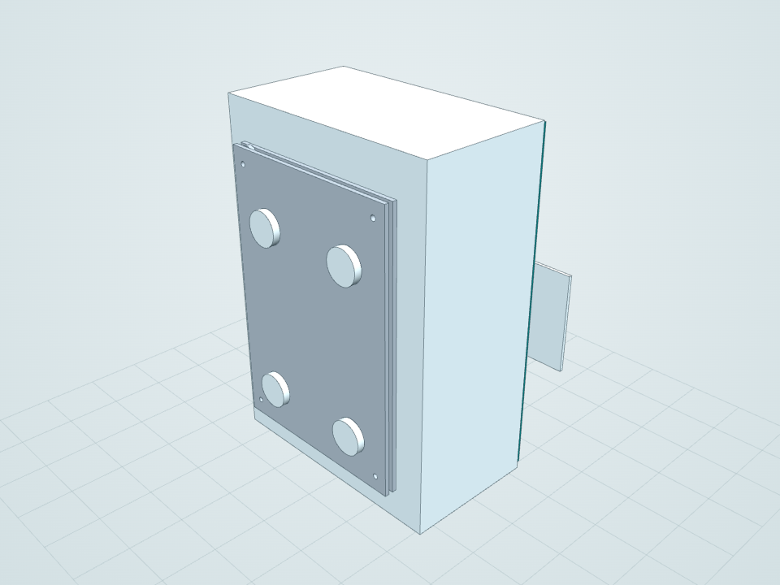<br><b>Magnetic mount</b><br><sub>Magnet pots + tether (reserved)</sub></td>
  </tr>
  <tr>
    <td align="center">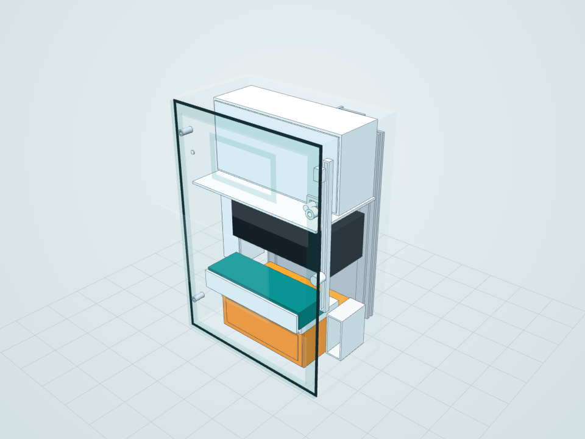<br><b>Internal layout</b><br><sub>X-ray through the housing</sub></td>
    <td align="center">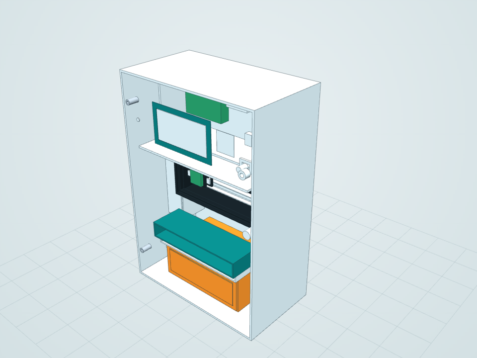<br><b>Service access</b><br><sub>Front covers removed</sub></td>
    <td align="center">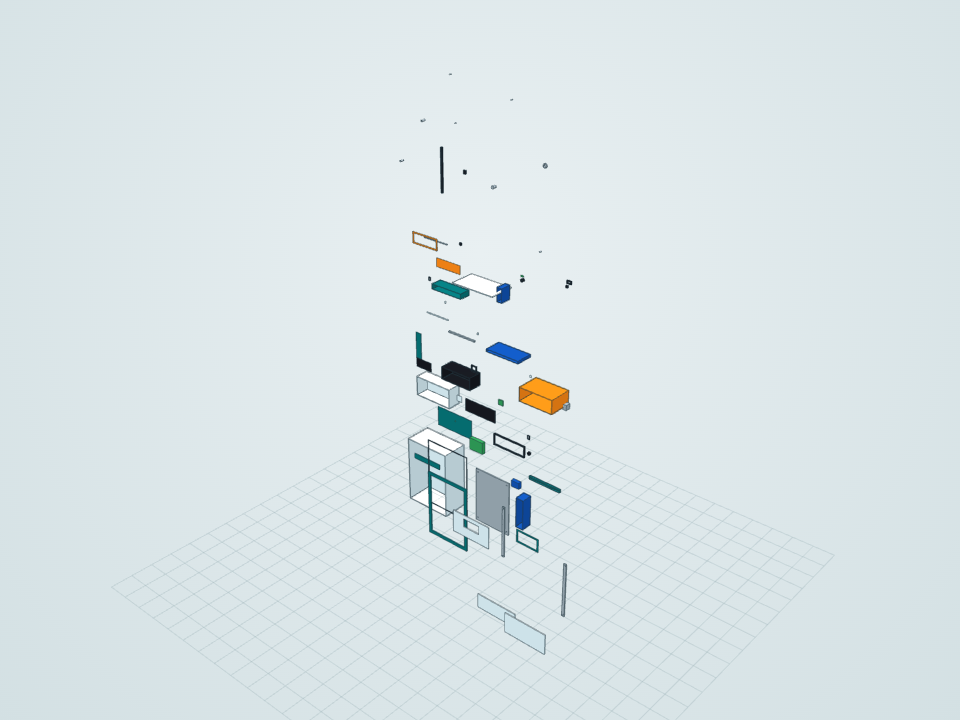<br><b>Exploded layout</b><br><sub>Separated-parts review</sub></td>
  </tr>
</table>

<details>
<summary><b>Installed on host infrastructure (illustrative)</b></summary>
<br>
<table>
  <tr>
    <td align="center">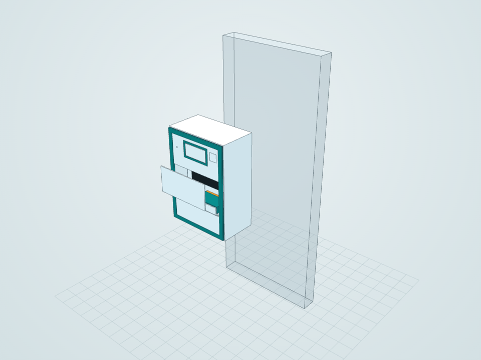<br><sub>Partition</sub></td>
    <td align="center">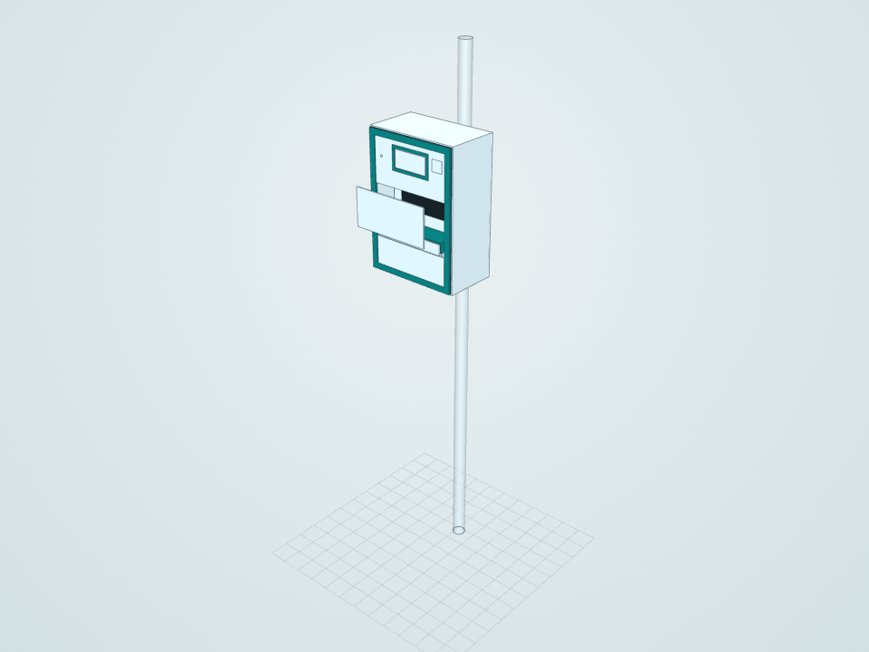<br><sub>Rail / post</sub></td>
    <td align="center">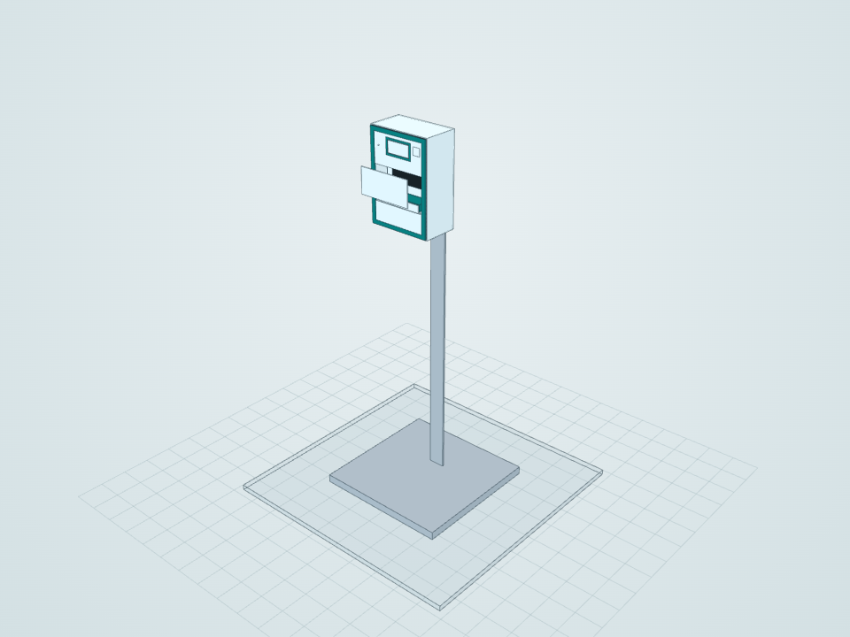<br><sub>Floor pedestal</sub></td>
    <td align="center">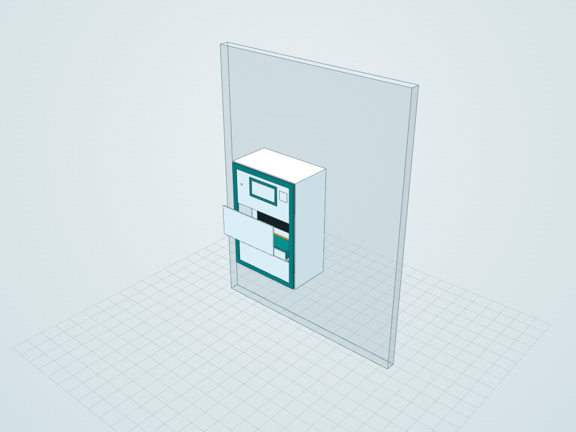<br><sub>Smooth wall</sub></td>
  </tr>
</table>
The host geometry (panel, post, floor, wall) is reference only and is not part of the product.
</details>

## Quick start

1. **[Download the ZIP](https://github.com/tamnisan/luma/archive/refs/heads/main.zip)** (or **Code → Download ZIP** on GitHub), or clone it:
   ```bash
   git clone https://github.com/tamnisan/luma.git
   ```
2. **Extract** the zip (right-click → *Extract All*). Don't open files from inside the zip, because the viewer and the SolidWorks assembly need their neighbouring files.
3. **Double-click `START.html`.** The interactive 3D model opens in your browser, offline, with nothing to install.

## Open the model

| What you have | What to open |
|---|---|
| **Just a web browser** | `START.html` → [browser 3D viewer](#1-browser-3d-viewer-no-install) |
| **FreeCAD, Fusion 360, Onshape, Inventor, Solid Edge, CATIA, …** | [`exports/step/`](builds/20260913-163314/exports/step/): one STEP assembly per configuration |
| **SolidWorks 2026 or newer** | [`Luma_Retrofit.SLDASM`](builds/20260913-163314/): native parametric model |
| **A slicer / 3D printer** | [`exports/stl/`](builds/20260913-163314/exports/stl/): one STL per part |
| **Nothing downloaded** | Open any `.stl` in [`exports/stl/`](builds/20260913-163314/exports/stl/) on GitHub; it renders a rotatable 3D preview |

### 1. Browser 3D viewer (no install)

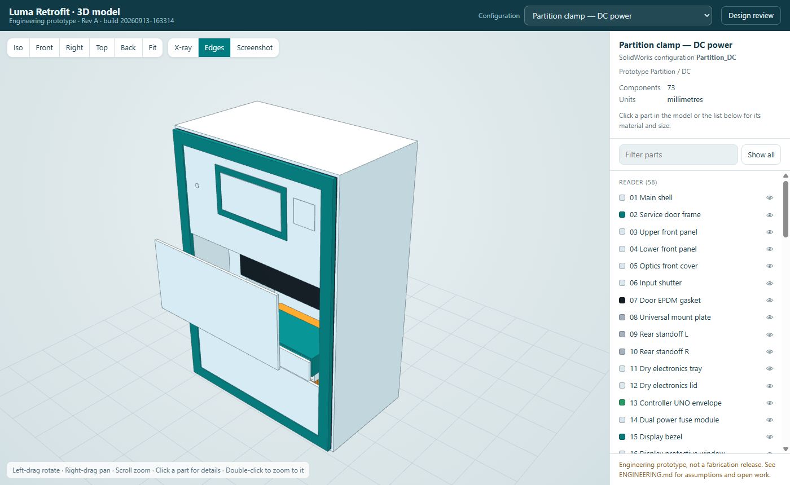

`START.html` opens `builds/20260913-163314/Viewer.html`. It runs offline in current Chrome, Edge, Firefox and Safari.

| Action | How |
|---|---|
| Rotate / pan / zoom | Left-drag / right-drag / scroll |
| Part details (material, process, size, file) | Click a part in the model or in the parts list |
| Zoom to a part | Double-click it |
| See inside the housing | **X-ray** button or `X` |
| Standard views | **Iso / Front / Right / Top / Back** or keys `1`–`5`; `F` to fit |
| Hide or isolate parts | Eye icon in the list, **Isolate** / **Hide** buttons, `H`; `Esc` clears |
| Save an image | **Screenshot** |
| Link to a configuration | Append it after `#`, e.g. `Viewer.html#Rail_Battery` |

A **Design review** link opens [`Review.html`](builds/20260913-163314/Review.html). It holds the dimensioned drawings, native SolidWorks renders, a filterable bill of materials, mass estimates and the engineering record.

> [!TIP]
> **Host the viewer online for free:** in your fork go to **Settings → Pages**, set *Source* to **Deploy from a branch**, choose `main` and `/ (root)`, then save. The model will be viewable at `https://<user>.github.io/<repo>/START.html`.

### 2. STEP (any CAD program)

Each file is a STEP AP214 assembly in millimetres, with colours. Import it with **File → Open / Import**: in FreeCAD use *File → Open*, in Fusion 360 use *Upload*, in Onshape use *Import*.

STEP carries the solid geometry but not SolidWorks' feature history or equations. To change dimensions parametrically, use the generator ([Building from source](#building-from-source)).

### 3. SolidWorks (native, parametric)

Open `builds/20260913-163314/Luma_Retrofit.SLDASM` and keep its `parts/` folder beside it. Choose a configuration in the **ConfigurationManager**. Also included are `Luma_Exploded.SLDASM` (separated-parts assembly) and `Luma_GA.SLDDRW` (general-arrangement drawing).

> [!NOTE]
> SolidWorks files open only in the version that saved them or newer, so these need **SolidWorks 2026+**. The free [eDrawings Viewer](https://www.edrawingsviewer.com/) has the same version requirement. On older versions, use the STEP files.

### 4. STL (3D printing)

These are binary STL files in millimetres, one per part, each in its own coordinate system. Check the `Process` column in [`BOM.csv`](builds/20260913-163314/BOM.csv) first. Parts named `*_envelope` only reserve space for purchased components (Arduino, sensor, battery, motor, …), and items marked COTS should be bought, not printed.

## Configurations

| Mount | DC power | Battery power | Installed on host (illustrative) |
|---|---|---|---|
| Partition clamp | `Partition_DC` | `Partition_Battery` | `Installed_Partition` |
| Rail clamp | `Rail_DC` | `Rail_Battery` | `Installed_Rail` |
| Over-partition hook | `Hook_DC` | `Hook_Battery` | none |
| Floor pedestal | `Pedestal_DC` | `Pedestal_Battery` | `Installed_Pedestal` |
| Smooth-surface pads | `Smooth_DC` | `Smooth_Battery` | `Installed_Smooth` |
| Magnetic mount | `Magnetic_DC` | `Magnetic_Battery` | none |

There is also `Service_Open` (front covers removed) and the separate exploded assembly. The STEP file for each configuration is `exports/step/Luma_<Configuration>.step`.

## Design overview

| | |
|---|---|
| **Enclosure envelope** | 230 W × 330 H × 134 D mm; 150 mm projection including the rear adapter |
| **Estimated dry mass** | ≈ 5.4 kg (partition / DC). This is an analytic estimate from geometry and assumed densities, not a weighed or certified value |
| **Electronics allowance** | Arduino Uno, TCS34725 RGB sensor, two white LEDs, display, status LED, buzzer, dual power fuse module |
| **Optics** | Enclosed black optical chamber, moving sensor/LED scan carriage on a rail with lead screw and motor, calibration tile |
| **Consumables** | Sealed clean-strip cassette, sample drawer, used-strip waste cartridge with closure slide, drip tray, cleaning-fluid cartridge |
| **Power** | DC connector with cable gland and strain relief, **or** a removable battery tray (75 × 23 × 39 mm protected-pack allowance) |
| **Safety interlocks (reserved space)** | Door interlock, cartridge-present switch, drip-overflow sensor, strip-jam/home sensor, service lock, tether eye |
| **Common mount interface** | 180 × 260 × 4 mm stainless adapter plate, 4 × Ø5 mm holes; no new holes in the building |
| **Materials** | PC-ABS (printed enclosure), black PC-ABS (optics), polypropylene (wetted trays and cartridges), 304 stainless steel (mounts, hinges, fasteners), EPDM (gaskets and pads), polycarbonate (display window) |
| **Prototype cost allowance** | INR 8,867–18,667 before stand, connectivity, labour and validation (planning figures, not quotes) |

| Zone | Layout |
|---|---|
| Dry electronics | Upper tray with sealed lid, full wet/dry barrier below |
| Unused strips | Separate left cassette with removable lid |
| Optics | Right central chamber, black insert, moving RGB/LED carriage, fixed strip datum |
| Sample input | Removable front tray behind a shutter |
| Waste | Lower removable cartridge with closure slide |
| Cleaning | Small fluid-cartridge allowance plus removable wetted inserts |

The full site-suitability rules for each mount, load cases, stability checks, assembly and service sequence, and installer survey are in [ENGINEERING.md](ENGINEERING.md).

## Repository structure

```
luma/
├── START.html                    Opens the 3D viewer
├── index.html                    Project website (GitHub Pages homepage)
├── README.md                     This file
├── ENGINEERING.md                Design intent, assumptions, mounting matrix, loads, service, costs, open work
├── LICENSE                       MIT
├── CITATION.cff                  Citation metadata ("Cite this repository")
├── sitemap.xml                   Sitemap for search engines
├── LATEST.txt                    Name of the current build folder
├── docs/                         README images and the social preview card
├── builds/
│   └── 20260913-163314/          Current build
│       ├── Viewer.html, viewer/  Offline 3D viewer and its model data
│       ├── Review.html           Design review (drawings, renders, BOM, engineering record)
│       ├── Luma_Retrofit.SLDASM  Main assembly (+ Luma_Exploded.SLDASM, Luma_GA.SLDDRW)
│       ├── parts/                109 native SolidWorks parts
│       ├── exports/step/         STEP assembly per configuration
│       ├── exports/stl/          STL mesh per part
│       ├── exports/scene.json    Component placement per configuration
│       ├── BOM.csv               Part envelopes, positions, materials, processes
│       ├── views/                Native SolidWorks renders
│       └── VALIDATION.md, *.txt  Rebuild, sketch, geometry and interference check records
└── src/                          Generator, checks, exporter, viewer and report source
```

## Building from source

The CAD is produced by a pipeline you can re-run, change and extend.

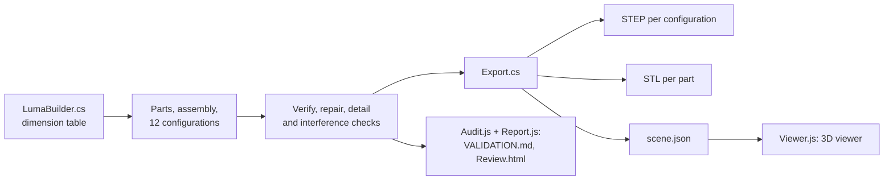

### Requirements

- Windows with **SolidWorks 2026 or newer** and a licence
- .NET Framework 4.x (included with Windows)
- [Node.js](https://nodejs.org) 18+ for the viewer and reports
- Default templates set in SolidWorks (**Tools → Options → Default Templates**)

The SolidWorks install is found through the registry. Set `SOLIDWORKS_DIR` to use a different one.

### Commands

```powershell
# Full rebuild into a new builds\<timestamp> folder (updates LATEST.txt)
powershell -ExecutionPolicy Bypass -File src\Build.ps1

# After editing the current model in SolidWorks: refresh STEP, STL, the 3D viewer and the review
powershell -ExecutionPolicy Bypass -File src\Build.ps1 -ExportOnly

# Zip the current build (e.g. to attach to a GitHub Release)
powershell -ExecutionPolicy Bypass -File src\Package.ps1
```

Run only one builder at a time against a SolidWorks instance. The exporter opens the model read-only and restores your export settings afterwards.

### Changing the design

Every part's size and position is in `Layout()` in [`src/LumaBuilder.cs`](src/LumaBuilder.cs), in millimetres. Edit it and run a full rebuild. Parts are built from sketches and extrusions whose dimensions are linked to global variables. There is no master skeleton or mechanical mates yet, so a change to one part does not resize its neighbours automatically.

| Source | Purpose |
|---|---|
| `src/LumaBuilder.cs` | Generates every part, the assembly and its configurations |
| `src/Verify.cs` | Reopens and rebuilds parts, constrains sketches, measures bodies, checks interference |
| `src/RepairConfigurations.cs`, `Scenes.cs`, `Finalize.cs`, `FinalAudit.cs` | Configuration checks, host reference scenes, exploded assembly, final views |
| `src/HardwareDetails.cs` | Screw clearances, rail-saddle relief, hook-plate separation |
| `src/Export.cs` | STEP per configuration, STL per part, placement data for the viewer |
| `src/Viewer.js`, `src/Viewer.html` | Builds the offline viewer and checks each placement against SolidWorks' own component boxes |
| `src/Audit.js`, `src/Report.js` | Validation record, design review and dimensioned SVG drawings |

## Project status

**Rev A: packaging and layout prototype.** What exists and what still has to be done:

- [x] Native, reproducible CAD for the enclosure, internals and six mounts
- [x] All sketches fully constrained; zero static interferences in all 12 mount/power configurations
- [x] Open-format exports and a browser viewer
- [x] Engineering record: assumptions, load cases, site survey, service sequence, cost allowances
- [ ] Mechanical mates, bearings, travel stops and a motion study for the scan mechanism
- [ ] Detailed strip feed/eject kinematics and jam/carry-over testing
- [ ] Optical bench study: sensor distance, LED angle, pad-specific calibration
- [ ] Seals, drainage and an IP54/IP55 enclosure test
- [ ] Mount load, creep and surface-damage tests; clamp hardware detailing
- [ ] Manufacturing detail: fillets, draft, ribs, bosses, threaded inserts, tolerances
- [ ] Electrical interlocks, firmware and user interface
- [ ] Analytical and clinical validation for the chosen test strips

See *Verification and remaining development* in [ENGINEERING.md](ENGINEERING.md#verification-and-remaining-development) for the evidence needed for each item.

## Contributing

Contributions are welcome, whether design improvements, test results, fixes or documentation.

1. **Open an issue** to report a problem or propose a change. For design issues, name the configuration and part (e.g. `Rail_DC`, `27_Scan_rail`).
2. **Fork** the repository and create a branch.
3. **Make the change in the generator** (`src/`) rather than editing parts by hand, so it stays reproducible. Then run `src\Build.ps1`, or `-ExportOnly` if you edited the model directly.
4. **Commit the new build folder** with its `exports/`, `viewer/` and check records, and update `LATEST.txt`. Don't commit `.exe` or SolidWorks `.dll` files; `.gitignore` excludes them.
5. **Open a pull request** that describes what changed and how you checked it: the rebuild log, `VALIDATION.md` and `final-interferences.txt`.

No SolidWorks licence? You can still help: review the design in the viewer or STEP files, check the engineering assumptions, share physical test data, or improve the documentation.

## License

This project is released under the [MIT License](LICENSE) © 2026 tamnisan. You may use, copy, modify, manufacture, distribute and sell it, commercially or not, as long as you keep the copyright notice. The design comes **as is, without any warranty**. Anyone who builds or deploys it is responsible for its safety and regulatory compliance.

**Third-party components:** the viewer bundles [three.js](https://threejs.org) r147 under the MIT License ([`src/vendor/three-LICENSE.txt`](src/vendor/three-LICENSE.txt)). SolidWorks and eDrawings are trademarks of Dassault Systèmes; this project is not affiliated with or endorsed by Dassault Systèmes.

## Citation

If you use this design in research or a derived project, please credit it:

```bibtex
@misc{luma_retrofit_2026,
  title        = {Luma Retrofit: an open CAD design for a removable urine-strip reader for public toilets},
  author       = {tamnisan},
  year         = {2026},
  howpublished = {\url{https://github.com/tamnisan/luma}},
  note         = {Engineering prototype, Rev A}
}
```

## Acknowledgements

- Concept based on the *Smart Health Kiosks: Democratizing Diagnostics via Public Infrastructure* presentation.
- 3D viewer built with [three.js](https://threejs.org).
- Geometry generated through the [SolidWorks API](https://help.solidworks.com/2026/english/api/sldworksapi/welcome.htm).
